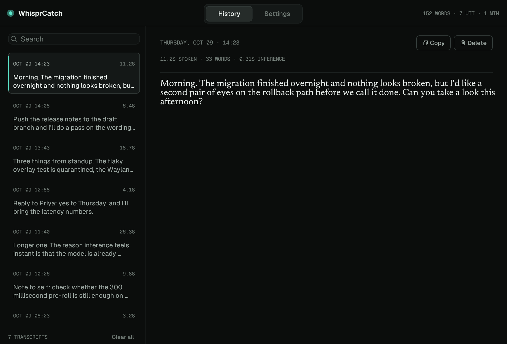
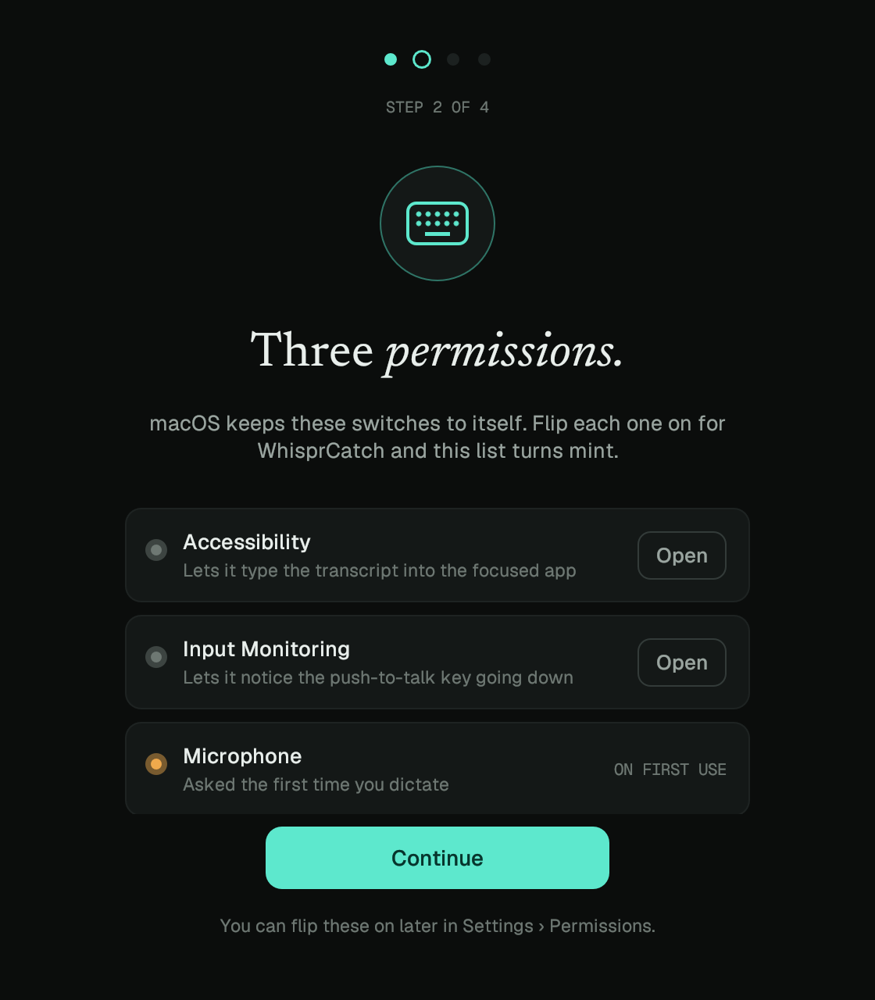
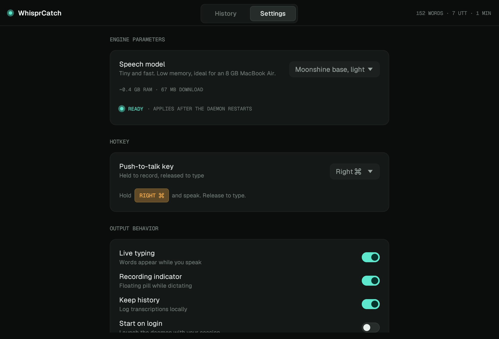

<div align="center">


# WhisprCatch

**Hold a key. Speak. Punctuated text appears wherever your cursor is.**

Local push-to-talk dictation for **macOS and Linux** — no cloud, no account, no audio leaving your machine.

[](LICENSE)
[](https://github.com/AviroopPaul/whisper-catch/releases/latest)
[](#install)

[**whisper-catch.vercel.app**](https://whisper-catch.vercel.app)

</div>

---


## Why

- **On-device and private.** All inference runs locally via ONNX Runtime. Audio is never written to disk and never leaves the machine.
- **Real punctuation and capitalization.** The model emits properly punctuated text — no "period" or "comma" voice commands.
- **Fast.** ~25× realtime on CPU; live typing streams words while you're still speaking, the rest lands the moment you release the key.

## The app

Most of the time it's a menu-bar icon and a small pill while you talk. Open it and
there's a searchable log of what you've dictated, plus settings — all local.



| First run | Settings |
| --- | --- |
|  |  |

<sub>Transcripts shown are sample text, not a real history.</sub>

## Install

### macOS (Apple Silicon)

```sh
brew install --cask AviroopPaul/whisprcatch/whisprcatch
```

Then open **WhisprCatch** from Applications. macOS needs three permissions before
it can hear the hotkey and type for you — Accessibility, Input Monitoring, and
Microphone. The first-run wizard opens each pane for you.

> macOS only re-reads those permissions when an app starts, so **quit and reopen
> WhisprCatch after granting them**. `whisper-catch doctor` prints their live status.

Hold **Right ⌘**, speak, release. macOS 11+, Apple Silicon.

### Linux (Ubuntu/Debian, x86-64)

1. Download the `.deb` from the [latest release](https://github.com/AviroopPaul/whisper-catch/releases/latest).
2. Double-click it (or right-click → *Open with App Center*) and install.
3. Launch **WhisprCatch** from your app menu.

Or from the terminal:

```sh
sudo apt install ./whisper-catch_amd64.deb
whisper-catch ptt
```

A first-run wizard handles keyboard permission (a one-time polkit prompt) and the model download (NVIDIA Parakeet 0.6B, ~660 MB, resumable, SHA-256 verified).

## Usage

Hold the push-to-talk key (**Right ⌘** on macOS, **Right Alt** on Linux), speak, release — the transcription is typed into whatever window has focus. A menu-bar/tray icon shows recording state, session stats, and shortcuts; `whisper-catch settings` opens settings and your local transcription history, and `whisper-catch doctor` prints permission and model status.

Configuration lives at `~/Library/Application Support/whisper-catch/config.toml` on macOS, `~/.config/whisper-catch/config.toml` on Linux:

| Key | Default | Description |
| --- | --- | --- |
| `key` | `rcmd` / `ralt` | Push-to-talk key (`rcmd`, `lcmd`, `ralt`, `lalt`, `rctrl`, `lctrl`, `super`, `f13`, `scrolllock`, …) |
| `model` | `moonshine` / `parakeet` | `parakeet` (best accuracy, ~660 MB) or `moonshine` (tiny, ~64 MB) |
| `streaming` | `true` | Type words live while speaking instead of all at once on release |
| `overlay` | `true` | Show the floating recording pill while dictating |
| `history` | `true` | Keep a local log of transcriptions (`history.jsonl`) |

Defaults differ per platform: macOS starts on Moonshine, Linux on Parakeet.

Live typing shows the words the *model* produced. Once a text-cleanup transform is
enabled, the finished transcript can differ from them, so the release pass replaces
what was typed live rather than appending to it. Where typed text cannot be taken
back — Wayland, which offers no way to release a key you are still holding — live
typing pauses while cleanup is on and the finished text is typed once on release.

## How it works

Speech models run as int8 ONNX on the CPU via ONNX Runtime ([transcribe-rs](https://crates.io/crates/transcribe-rs)) — no GPU, no network. The mic is kept warm with a 300 ms pre-roll so the first syllable isn't clipped.

The platform-specific parts:

| | macOS | Linux |
| --- | --- | --- |
| Hotkey | listen-only `CGEventTap` | raw evdev (X11 + Wayland) |
| Injection | `CGEvent` via enigo | XTEST |
| Tray | native `NSStatusItem` | `ksni` (StatusNotifierItem) |
| Autostart | LaunchAgent | XDG autostart |

Workspace: `crates/core` (capture, resample, engine), `crates/hotkey`, `crates/inject`, `crates/models`, `crates/tray`, `apps/cli`. See [`SCOPE.md`](SCOPE.md) for the full design doc.

## Building from source

```sh
# Linux
sudo apt install cmake clang libasound2-dev
cargo build --release -p whisper-catch

# macOS (Xcode command line tools only)
cargo build --release -p whisper-catch
```

For a `.deb`: `cargo install cargo-deb`, then `cd apps/cli && cargo deb`.
For a `.dmg`: see [`packaging/macos/README.md`](packaging/macos/README.md) — note that
release builds are signed with a self-signed certificate, which is what keeps
macOS permission grants from resetting on every update.

## Roadmap

- **Notarization** — a Developer ID would drop the Homebrew quarantine workaround and make the raw `.dmg` double-clickable.
- **Intel Macs** — currently Apple Silicon only.
- **Wayland text injection cascade** — wlroots virtual-keyboard → uinput fallback.
- **Streaming-native model** — true incremental decoding instead of rolling re-transcription.

## License

[MIT](LICENSE) © Aviroop Paul
